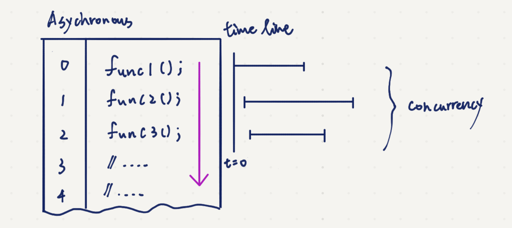

# 檔案讀寫

電腦科學中資料讀寫包含存取（input, I）和輸出（output, O），這也是為什麼常常看到 I/O 這個術語的原因。在電腦科學術語中中，廣義的 I/O 包含直接對檔案（file）、緩存（Buffer）以及數據流（stream）做操作。檔案就是已經存放在儲存裝置中的文件，緩存是還在記憶體中的資料，數據流則是一串序列化的抽象資料，這再晚點會深入介紹。

資料傳輸在寫程式的時候，不管是你想要從文件中讀取資料，或是資料從網路上傳輸，亦或是資料在程式與程式之間傳送，都常常會用到。事實上我們寫程式通常也就是為了處理資料，如果沒有資料的話，還真的不曉得程式乘坐什麼事情！（有啦，算算質數之類的 XD）

本篇會將 NodeJS 上會用到數據型態作介紹，當作先備知識。接著只會著重在檔案讀寫講解範例，其餘像是數據流的操作、緩存的處理，待日後的進階文章才會詳細介紹。

## 數據型態

在談寫程式之前，先來瞭解一下電腦科學中的三種數據概念吧！

### 檔案（file）

檔案，或稱文件。操作一份文件時，例如一個文字檔，你會需要先在系統上建立一個文件，這步驟相當於在系統的索引上登錄，此外系統會幫以配置空間給檔案。每當你要修改文件的時候，你需要先開啟那個檔案，才能進行寫入和讀取。

檔案會儲存在電腦的儲存裝置上（storage），通常就是硬碟，像是 SSD，當然軟碟、光碟那些也都是。不過資料從儲存裝置存取的速度通常很慢，SSD 讀大概 500 MB/s 寫 100 MB/s，但你想想網路光纖已經都用 GB 起跳了，就知道真的很慢。

因為從裝置讀取速度跟網路或記憶體相比來說很慢，因此常常會是效能的瓶頸，這種情況稱為 [I/O bound](^1)，代表因為在存取檔案的時候，執行緒因為必須等 I/O 處理，而導致程式被卡住，因此效能變差。同理，如果是因為程式複雜度太高，而導致程式效能差，就稱為 CPU bound。

與檔案相關的操作，在 NodeJS 中是 [`fs`](https://nodejs.org/api/fs.html) 模組[^3]，亦即檔案系統（file system）。

### 數據流（Stream）

數據流，是指資料從一邊流向另一邊。


假設你今天想要把 `file1` 搬過去 `file2`，如果直接用檔案方式來處理，那程式會先將 `file1` 檔案的內容一次全部讀進去記憶體中，待讀完之後，再一次寫進 `file2` 檔案中。這時候會發生先前提到的問題，就是整個程序就被這個 I/O 給卡死了。

所以我們需要聰明一點的方法，於是我們在搬資料的時候，不是等全部搬完才開始做事，而是每次搬一點（英文術語是 chunk），並且每次搬的東西可以先做處理，這樣就不用等很久全部都進記憶體才能做事，這樣也可以省下不少記憶體。舉個例子，就像我（資料來源）有一大堆蘋果要給 Charlie（資料去處），但因為太多了，所以我只能一批一批送過去。

事實上在 NodeJS 中，數據流只是抽象介面層，這代表 NodeJS 都幫你處理好底層的東西，像是要怎麼處理搬運的這類問題都不用管，只要使用包裝好的 API 就可以。通常在處理 HTTP 和行程（process）的輸出時，都會用到數據流的概念。

如果有用到數據流的話，NodeJS 中要引入 [`stream`](https://nodejs.org/api/stream.html) 模組[^3]。

### 緩存（Buffer）

緩存，又稱緩衝或暫存。

想像我們在數據流搬運數據，那些正在被搬的數據會需要個乘載工具，這個地方就是記憶體。相較於一次讀完，數據流是一點一點讀，所以每次只會有固定大小的資料被放入記憶體中。


程式處理數據流的時候也是一部份一部份處理，程式會跟系統要一塊記憶體空間建立一個緩衝區（buffer），每次資料就先放入緩衝區，等程式把資料處理完，就會從緩衝區拿下一份，然後緩衝區會再從資料來原先取資料放入緩衝區。在資料被送給程式之前，你也可以對在緩衝區的緩存做處理。

用白話的方式說明的話，我有很多蘋果，但 Charlie 吃的速度也沒那麼快，為了避免她吃完，還要等我送過去花太多時間，所以先將每批蘋果先送去 Charlie 的冰箱（Buffer），放在冰箱的那些蘋果可以先被做一處理（清洗、切削），等 Charlie 吃完她手上的蘋果，他就會從冰箱取出，這時候我就會再送一批新的蘋果給她。為什麼要這樣做呢？這是建立在蘋果送去冰箱的速度比 Charlie 吃掉手上的蘋果還快，於是乎 Charlie 就能一直有蘋果吃，且他都不會有什麼等待時間，這就是數據流和緩存的概念！

NodeJS 中的緩存實作在 `Buffer` 模組，不過使用時不用特別去引用。

## 同步與異步

我們已經認識資料在電腦中會有哪幾種型態了，我們在 NodeJS 要處理資料的時候，其實就是用剛剛提到的 `fs`、`stream` 和 `Buffer`來做操作。不過在開始講檔案操作之前，必須先瞭解 NodeJS 模組中的同步執行（synchronous process）和異步執行（asynchronous process）[^4]。這邊簡單介紹，在之後會有更深入的討論。

### 異步執行

NodeJS 在設計上模組主要都是採用異步處理（雖然也有提供同步版本，後面會提到），也就是說這些模組的函式（module API）被呼叫執行的時候，不會等這一行完全跑完才去執行下一行，而是當函式被呼叫之後，程式會直接繼續往下執行，而剛剛被呼叫的那個函式跟接下去跑的程式會一起並行執行（concurrency process）[^5]。



有異步處理的需求像是，我們有一個伺服器，你不希望你在處理 `A` 使用者的時候，必須等到 `A` 這邊都處理完，才能接收 `B` 使用者的請求。這時候就會採用異步方式，這樣就可以同時處理 `A` 和 `B` 資料。異步的使用，日後在寫伺服器的時候，我們會常常看到。

不過異步行為模式其實和其他語言非常不同，像是 C++、Python 等之類的程式語言，所有函式都是同步的，所以都會是從上到下一行一行執行。（當然他們也能寫異步，確切來說是這些語言的官方標準函式庫都是同步的）

舉例來說，`ex1.js` 打開檔案又關閉檔案，我們需要這樣寫：

!FILENAME ex1.js

```js
const fs = require('fs');

fs.open('/open/some/file.txt', 'r', (err, fd) => {
  if (err) throw err;
  fs.close(fd, (err) => {
    if (err) throw err;
  });
});
```

感覺不太直覺，因為正常思考會這樣寫（也就是其他語言通常是這樣）：

```js
//假想的寫法，都是虛擬碼

f = open('file_name'); // 打開檔案

fileContent = f.read(); // 讀取檔案

// 對 `fileContent` 做點操作
// ...

f.close() // 關閉檔案
```

所以回來看 `ex1.js`，當程式執行到 `fs.open()` 的時候，因為 JS 的特性是會並行執行，所以程式其實會繼續往下跑，所以假設我們這樣寫：

```js
fs.open()
// 做點事
fs.close()
```

這時候 `fs.close()` 因為會接著被執行到，所以才剛 `fs.open()` 打開，接著會馬上被 `fs.close()` 關閉，但我們其實是希望我們要做的事情都結束才去關閉檔案，所以我們將 `fs.close()` 包在 `fs.open()` 裡面。

此外我們還出查到一個現象，就是：

```js
fs.open("file", "r", (err, fd) => {});
```

這邊的第一個參數和第二個參數是設定值，就是告訴函數檔案名稱(`file`)，以及用讀取的模式(`r`)。但可以看到，在第三個位置是一個箭頭函數，這個是回傳函數（callback function）[^6]的回傳值（callback）。

當程式在執行一個是異步處理的函數 `func1`，此時程式已經在並行處理這個函式 `func1`，以及接下去跑接來的程式碼，假設這時候已經跑到 `func2` 和 `func3`  了，這時候程式怎樣知道 `func1` 已經得到資料並可以接下去執行？

```js
func1() // 這是一個異步程式
func2() // 這是一個異步程式
func3() // 這是一個異步程式
```

就是靠回傳函數，回傳函數會將呼叫函式得到的值，塞入函數的參數裡面（以剛剛例子就是 `err` 和 `fd`），這時候我們就可以在 `func1` 函數裡面的區塊，使用回傳函數的的回傳值繼續做事。

回傳函數可以是同步也可以是異步，不過當你看到某個 JS 的函式庫有用到回傳，通常他都是異步，這時候你寫程式就要留意，程式碼不會照著順序由上而下，而是會並行執行。

### 同步執行

有時候我們可能就是不想要程式碼是異步執行，也就是我們希望他就是一行一行執行下來，沒跑完那一行就不會走到下一行，也就是我們想要他同步，這樣我們的思維就可以跟其他語言一模一樣。

這時候我作法通常是以下兩種。

第一種，在 NodeJS 的內建模組中，只要原本是設計成異步的函數，有些會有對應的同步版本。比方說 `fs.stat`，他原本是異步的，你必須用回傳函數來操作他，但有另外一個 `fs.statSync` 函數，他就是同步的函數，就不會有回傳函數在裡面，像是：

!FILENAME ex2.js

```js
const fs = require('fs');
const stats = fs.statSync("./");
console.log(`這個目錄擁有者的 UID 是 ${stats.uid}`);
```

這時候會等到 `fs.statSync` 執行完， `stats` 真的拿到東西，程式碼才會繼續往下走。

執行結果會是：

```shell
$ node ex2.js
這個目錄擁有者的 UID 是 501
```

當然你的 UID 可能會是其他數字。假設你這邊不是用 `fs.statSync` 而是用 `fs.stat` 的話，就會噴錯：

!FILENAME ex2-error.js

```js
const fs = require('fs');
const stats = fs.stat("./"); // 異步執行
console.log(`這個目錄擁有者的 UID 是 ${stats.uid}`); // `fs.stat` 和這行並行
```

```log
$ node ex2-error.js

./ex2-error.js.js:4
console.log(`這個目錄擁有者的 UID 是 ${stats.uid}`);
                                    ^

TypeError: Cannot read property 'uid' of undefined
```

這是因為程式碼直接繼續往下走了，但他要讀取的 `stats` 還沒得到東西（還在跑），於是就出錯了。

第二種作法是使用 NodeJS 提供的 [`util.promisify()`](https://nodejs.org/api/util.html) 函數，並搭配使用 `async` 和 `await` 語法，就能把異步的程式都轉成同步的。這邊簡單帶過，之後會再深入討論到。

所以假設想用第二種寫法的話，會長成以下這樣，看不懂也沒關係，因為只是先給大家看看：

!FILENAME ex3.js

```js
const util = require('util');
const fs = require('fs');

const stat = util.promisify(fs.stat); // 轉換 fs.state 變成 promise 型態

(async () => { // 設定一個 async 函式，因為 await 一定要搭配 await

    // 只要在 async 區間裡面，所有 promise 型態的異步函數都可以用 await
    // 來讓他們變成同步

    const stats = await stat("./"); // 用 await 來讓程式等這行執行完
    console.log(`這個目錄擁有者的 UID 是 ${stats.uid}`);

})(); // 用隱函數方式讓他立即執行
```

你可以複製 `ex3.js` 程式碼用 NodeJS 跑跑看：

```log
$ node ex3.js
這個目錄擁有者的 UID 是 501
```

## 檔案操作

接下來就要討論怎樣做檔案操作了，平常你可以能會需要去讀取一些報表、實驗數據或一些記錄檔，這時候你大概就會去讀取 `.txt`、`.csv`、`.tsv` 等等的檔案。

接著我以如何處理 `data.csv` 為例，他只是一個簡單的二維物理運動的實驗數據。

!FILENAME data.csv

```csv
t,x,Y
0,0,0
1,0.5,0.2
2,0.6,0.3
3,0.7,0.6
4,0.9,0.7
5,1.3,0.9
6,1.5,1.1
7,1.7,1.2
8,1.9,1.3
9,2.4,1.5
10,4.5,1.7
```

我們可能會想要去算他的平均速度、平均加速度、瞬時最大加速度、總位移。我將透過 `ex4.js` 來說明如何做。

關於舉例，實在滿困擾的，因為筆者本身只懂理工，但我相信讀者可能有些是文組，雖然物理運動只是高一物理，但我這邊還是先解釋一下待求物理量的意義。

- 總位移：最後位置 - 最初位置
- 平均速度：總位移 / 總時間

其實物理也不是太大的重點，主要只是操作檔案讀取和操作資料，同樣概念可以延伸到任何領域，像是處理經濟、統計之類的。

!FILENAME ex4.js

```js
const fs = require('fs');

// 這邊用同步的方式來讀取檔案，因為我們希望有資料才接下去跑
//
// 用 `fs.readFile` 或 `fs.readFileSync` 的話，文件內容會
// 一次全部讀進記憶體
//
// 注意到，`fs.readFileSync` 第一個參數是讀取檔案路徑
// 第二個參數是編碼，我們將原本二進位的資料轉成 `utf8`
const fileContent = fs.readFileSync("./data.csv", "utf8");

// 讀進來會有一大串連續的資料，我們用 `\n`（換行符號） 來切割每一行
// `split` 函數可以針對指定字元作切割 
const lines = fileContent.split('\n');

// 印出 lines 看看，可以看到一個陣列包含了每一行
console.log(lines)

// 我們知道這個 csv 裡面有三個欄位
const t = [];
const x = [];
const y = [];

// 我們知道第一行(i = 0)沒有數據，所以從第二行(i = 1)開始找資料
// 用迴圈從第一行跑到最後一行，並處理資料
for (let i = 1; i < lines.length; i++) {
  // csv 格式用 `,` 做切割
  // 第 0 個會是 t
  // 第 1 個會是 x
  // 第 2 個會是 y
  items = lines[i].split(',');

  // 將每一行的數值，塞進之前定義的專屬陣列，`push` 就是往後塞
  t.push(items[0]);
  x.push(items[1]);
  y.push(items[2]);
}

// 都印出來看看
console.log(t)
console.log(x)
console.log(y)


// 總位移：最後位置 - 最初位置
// 因為是二維的座標，先找出 x 的總位移
const mov_x = x[x.length - 1] - x[0];
// 再找出 y 的總位移
const mov_y = y[y.length - 1] - y[0];
// 用畢式定理找出真正的總位移（兩股平方和開根號）
const movement = Math.sqrt(mov_x ** 2, mov_y ** 2);

// 平均速度：總位移 / 總時間
const avg_v = movement / (t[t.length - 1] - t[0]);

// 在終端機上印出結果
const output = `總位移： ${movement}\n平均速度： ${avg_v}`;
console.log(output);
// 同時也以同步方式把結果寫到 `data.txt` 檔案中
fs.writeFileSync("./data.txt", output);
```

你可以在你的工作目錄將 `data.csv` 和 `ex4.js` 複製一份，跑出來的結果會長的像以下（依序是「每一行的陣列」、「t 陣列」、「x 陣列」、「y 陣列」和「最後輸出」）：

```log
$ node ex4.js
[ 't,x,Y',
  '0,0,0',
  '1,0.5,0.2',
  '2,0.6,0.3',
  '3,0.7,0.6',
  '4,0.9,0.7',
  '5,1.3,0.9',
  '6,1.5,1.1',
  '7,1.7,1.2',
  '8,1.9,1.3',
  '9,2.4,1.5',
  '10,4.5,1.7' ]
[ '0', '1', '2', '3', '4', '5', '6', '7', '8', '9', '10' ]
[ '0',
  '0.5',
  '0.6',
  '0.7',
  '0.9',
  '1.3',
  '1.5',
  '1.7',
  '1.9',
  '2.4',
  '4.5' ]
[ '0',
  '0.2',
  '0.3',
  '0.6',
  '0.7',
  '0.9',
  '1.1',
  '1.2',
  '1.3',
  '1.5',
  '1.7' ]
總位移： 4.5
平均速度： 0.45
```

我們有將資料寫到新的文件 `data.txt` 中，你可以直接用編輯器打開來看，或是在終端機下指令來查看：

```log
$ cat ./data.txt
總位移： 4.5
平均速度： 0.45
```

`ex4.js` 這是一個簡單的例子，用意是讓你瞭解到如何用程式碼來對檔案作操作，向這邊就用到讀取一個文件，然後做一些處理，最後寫到另一份文件。單然，你可以做的事情更多，`fs` 模組中還可以讓你得到目錄資訊、建立目錄、刪除文件等等，當你想要對文件作處理的時候，可以去查查查看官方文件[^3]有哪些 API 可以使用。

此外在處理資料的過程中，你甚至可以結合一些其他的函式庫像是 [plotly](https://plot.ly/nodejs/getting-started/)，來產生視覺化的圖表。或是搭配使用資料庫，直接將資料存進資料庫。

## 小結

我們知道文件、數據流、緩存別是什麼，並學會如何對一個文件作處理。我們也知道 NodeJS 中的函數有同步跟異步之分。

假設你寫的是伺服器，你大概會採用異步操作資料；假設今天你只是個人需要寫個 script 來做點檔案和資料處理，那就全部用同步方式進行即可。

檔案操作還有很多不同的操作方式，比方說用多執行緒來平行計算，或是我們能用數據流的方式來處理，亦或加上管線（pipeline）[^7]操作，而此篇範例只是最基本的文件操作。

## 延伸參考

[^1]: [Wiki: I/O bound](https://en.wikipedia.org/wiki/I/O_bound)
[^2]: [JS Buffers matter! Sometimes.](https://medium.com/front-end-weekly/js-buffers-matter-sometimes-56150a35417f)
[^3]: [NodeJS official doc](https://nodejs.org/api/)
[^4]: [Wiki: Asynchrony](https://en.wikipedia.org/wiki/Asynchrony_(computer_programming))
[^5]: [Wiki: Concurrency](https://en.wikipedia.org/wiki/Concurrency_(computer_science))
[^6]: [JavaScript: What the heck is a Callback?](https://codeburst.io/javascript-what-the-heck-is-a-callback-aba4da2deced)
[^7]: [Wiki: Pipeline](https://en.wikipedia.org/wiki/Pipeline_(computing))
